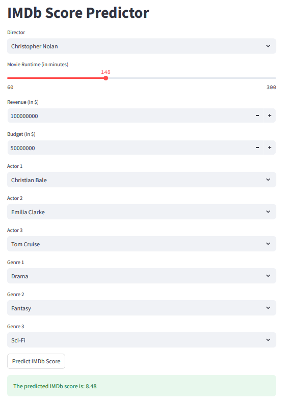

## IMDB Score Prediction
You can use this app to predict the IMDB score for any potential movie - input the movie director, cast, genre and budget. The random forest machine learning model predicts the IMDB score with an accuracy of 90%.

Consider a movie being directed by Christopher Nolan combining elemnts fo Drama, fantasy and Sci-Fi and starring Tom Cruise, Christian Bale and Emilia Clarke. the model predicts a score of 8.48!

